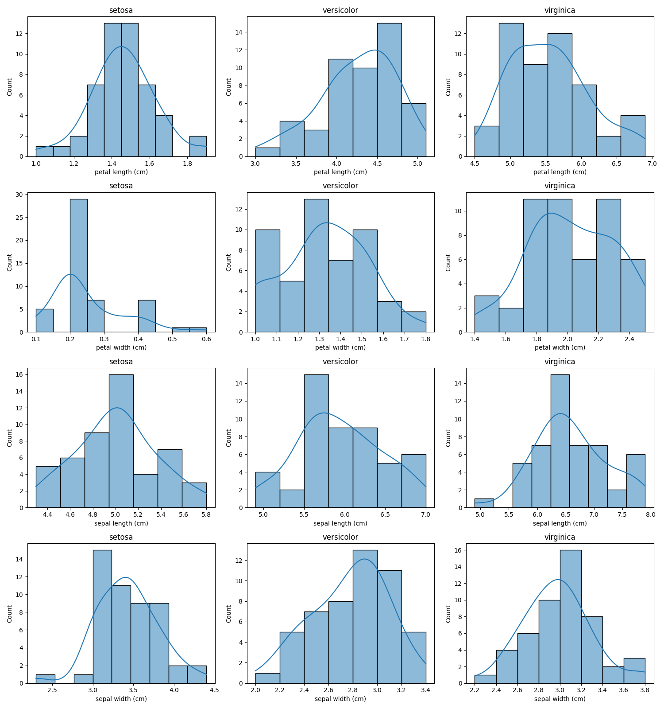

# Iris Machine Learning Project

| Setosa | Versicolor | Virginica |
|--------|------------|-----------|
|  |  |  |

## About The Project
The Iris dataset is one of the most well-known datasets in machine learning. This project provides a comprehensive exploration of the dataset through exploratory data analysis (EDA), data visualization, feature engineering, and machine learning models to classify iris flower species.

## Dataset
This project makes use of the famous Iris dataset, first used by Sir R.A. Fisher in his 1936 paper.

The dataset contains 150 instances of iris flowers across three distinct species:
- Setosa
- Versicolor
- Virginica

Each sample contains four features:
- Sepal length (cm)
- Sepal width (cm)
- Petal length (cm)
- Petal width (cm)

## Results

| Model | Accuracy | Precision | Recall | F1 Score |
|-------|---------|---------|---------|---------|
| Logistic Regression | 95.33% |
| Decision Tree | 95.33% |
| Random Forest | 95.33% |
| K-Nearest Neighbors | 97.33% |
| Support Vector Machine | 96.0% |

## Figures
### Petal Measurements

Petal length and width provide strong separation between the three species.

### Sepal Measurements

Sepal measurements show greater overlap, especially between Versicolor and Virginica.

### Pair Plot

The pair plot visualizes every feature combination and highlights that petal measurements are the most informative features.

### Distributions

